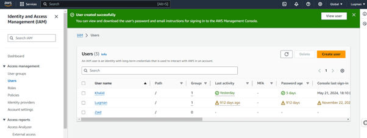

# IAM (Identity Access Mangement)

__*IAM is a global web service on AWS, which allows the administrator to control access to resource and manage user permissions*__ 

#### Root Account vs IAM User
* A root account is the account that is created by default to set up an AWS account. 
* This user's details should not be shared or even used. 
* The root user should be only used if necessary as it has access to all resources, assets, and instances and we don’t want that access compromised by unauthorised personnel. 
* Additionally, with users there is increased visibility on which user did what task, and with just 1 root user it's difficult to know who did what.  

  

#### MFA (Multi-Factor Authentication)

It is fundamental to set a strong password for IAM users and one way to ensure higher security for the accounts is to set up a password policy that requires specific character types and possibly requires that users change their password after some time (password expiration).

The second defence mechanism is MFA. MFA is using a password login plus authentication through a security device. Essentially if a hacker manages to steal your password and try to log in to possibly change configurations or delete resources, the hacker won't be able to enter the account. This is because the second layer of security (security device) requires authentication. MFA devices are of different types:

* Virtual MFA devices, such as: Google authenticator which provides a code used for authentication
* Universal 2nd Factor (U2F) Security key, such as: YubiKey (3rd party to AWS) and it is a physical device that supports multiple root and IAM users using a single key.
* Hardware Key Fob MFA device, such as: Gemalto (3rd party to AWS): provides a code used to authenticate.
* Hardware Key fob for AWS GovCloud (USA), such as: SurePassID (3rd party to AWS): provides a code used to authenticate. 

#### Creating IAM Policies:

When creating an IAM user and aligning permissions its important to follow the 

__*Least Privilleage Principle: Do not assign more permissions than the user needs*__ 

By adhering to this principle it mitigates the risk of hackers gaining access to sensitive data or resource by allowing only enough access to the user to perform their required tasks. 
