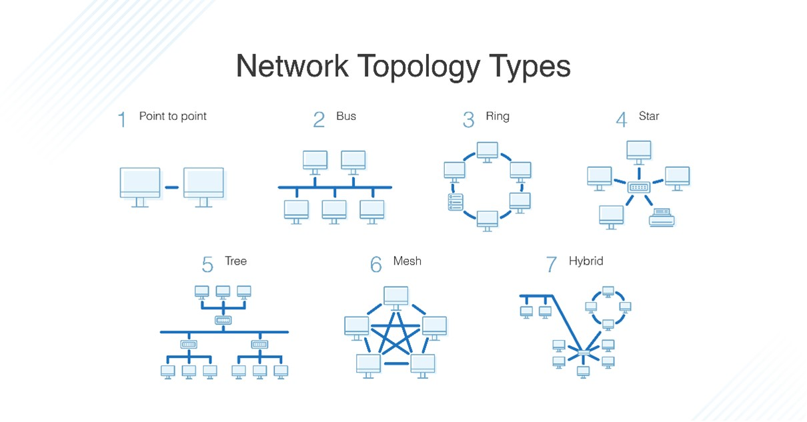
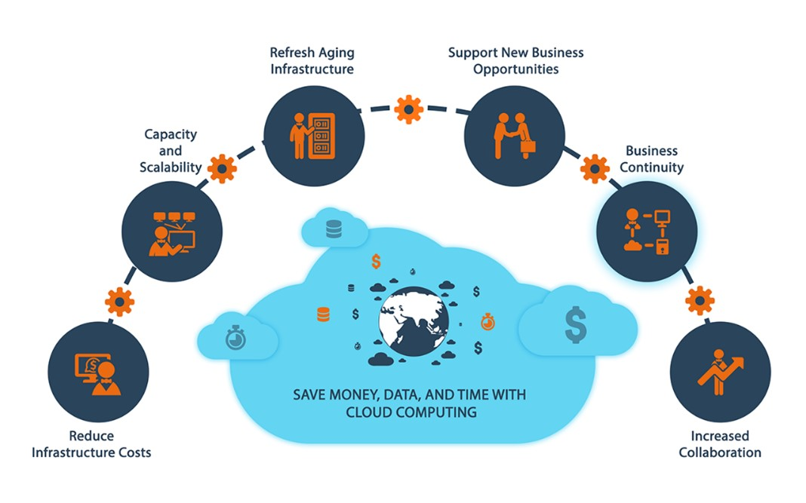
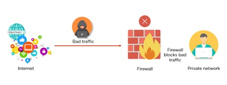

#  Network topology for a small office setup
#### __*Network topology is the arrangement of nodes within a network. A node is just simply a point of connection or intersection like a computer or router. In our example, we will be looking to create a network for a small office bearing in mind scalability, redundancy, and security.*__

### Scalability  
* One cost-effective infrastructure is the use of the cloud. The cloud allows servers to be accessed virtually (from any location) rather than on-prem. Due to the office being small, it would be expensive to host physical servers in another room or building.
* The cloud saves money for the company as only services that are needed are purchased and only data capacity can be limited or increased to the company's needs.
* The cloud allows for the scaling of resources and allows the company only to pay for what they use. With on-prem, the company would have to pay for physical servers, engineers to maintain them, and pay for any breaks in the network.
* With a few clicks capacity can be adjusted and services can be used 
 

### Redundancy  
* It is the process of reducing single points of failure in a network by producing multiple paths of traffic to ensure reliability.    
* So essentially making sure that if one point in the network fails, due to a disruption or outage, the rest of the network can still function and is available.   
* The downside to increasing the paths is that costs go up as there are more cables, routers, switches etc that are implemented into the network.  
* The use of the cloud is essential to remove distributions as they are minimal. If they do occur and an availability zone is down for the company region, they have access to other availability zones ensuring the availability of the network at all times

### Security  
* The best way to ensure your network is secure from data being accessed is through firewalls. Firewalls are also able to identify, block, and adjust specific applications  
* Firewalls monitor the incoming and outgoing network traffic/data, they then either allow the data to pass or block it. The firewall would be set up using a set of rules/policies that allow, block, replace or tag the data.  
* Firewalls encrypt data so that to hackers the data is not able to be read   
* Having both internal and external firewalls is perfect as it will protect the network from external threats and protect against traffic sent between internal users of the network.

