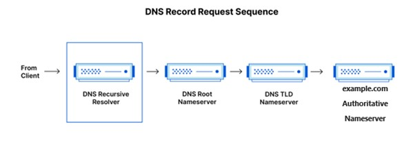

# What happens when you type "www.example.com" into a web browser?

### Lets say user Alan wants to access the site example.com
1. Firstly, Alan types the **URL** (Universal Resource Locator), for example, http://www.example.com/devices/laptop, in a search bar and presses enter  
    a. **http** is the **Scheme** that tells the browser to connect to the server using http another more encrypted version of this is https which encrypts the connection between sites increasing security and decreasing the possibility of hackers accessing sensitive information.  
    b.	**www** is known as the **Subdomain**. It is usually used to separate a section of the website from the main page. In this case www is used for the homepage of a website whilst shop.exmaple.com would be used for the shop side of the website as an example  
    c.	**example.com** is the **Domain**, like Facebook.com or Netflix.com, it is the name of the domain the user wants to access.  
    d. **devices** is known as the **Path** and **laptop** is known as the **Resource**. One way I remember the difference between them is that the path is like a directory and the resource is like a file within that directory.

2.	The browser now needs to contact the server but needs to locate its **IP address** to allow for communication. So, it utilises **DNS (Domain Name System)** which is essentially like a phone book of the internet including ‘phone numbers’ i.e IP address of servers  
    a.	Firstly, the browser looks to locate the IP address of the server (example.com) in the **cache** for a quick result. The **cache** is a small amount of memory which stores the most frequently visited sites on your operating system (phone, laptop, iPad etc).  
    b.	IF the IP address cannot be located in the cache the browser will send a query to the internet using 4 types of DNS servers: DNS resolver – DNS Root Nameserver – DNS TLD nameserver – Authoritative names server.

       

3. Once the IP address of the server is located, the browser establishes a **TCP (Transmission Control Protocol)** connection to the server allowing for back-and-forth communication. TCP is used to allow for back-and-forth communication between the browser and server.

4.	Once the **TCP** connection is established the browser sends a http request to the server 
5.	The server then sends back a http response to the initial request.
6.	And finally, the browser renders the http content of example.com allowing Alan to interact with the webpage.
